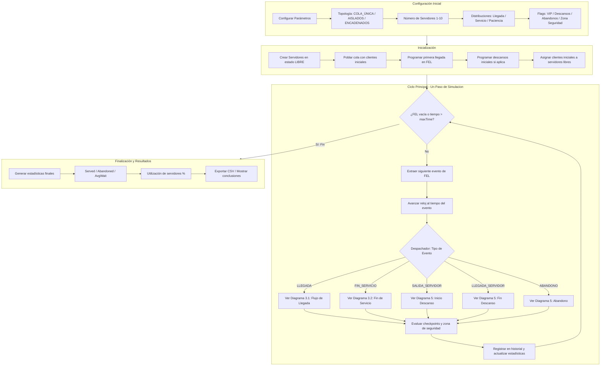
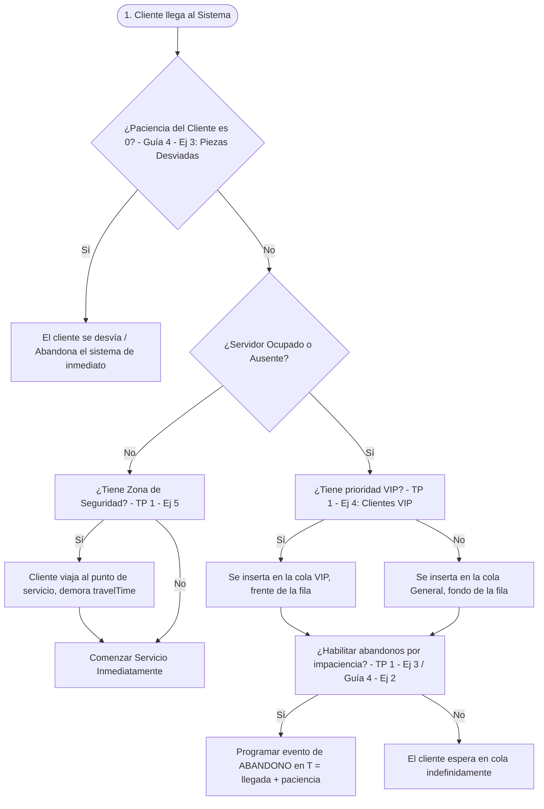
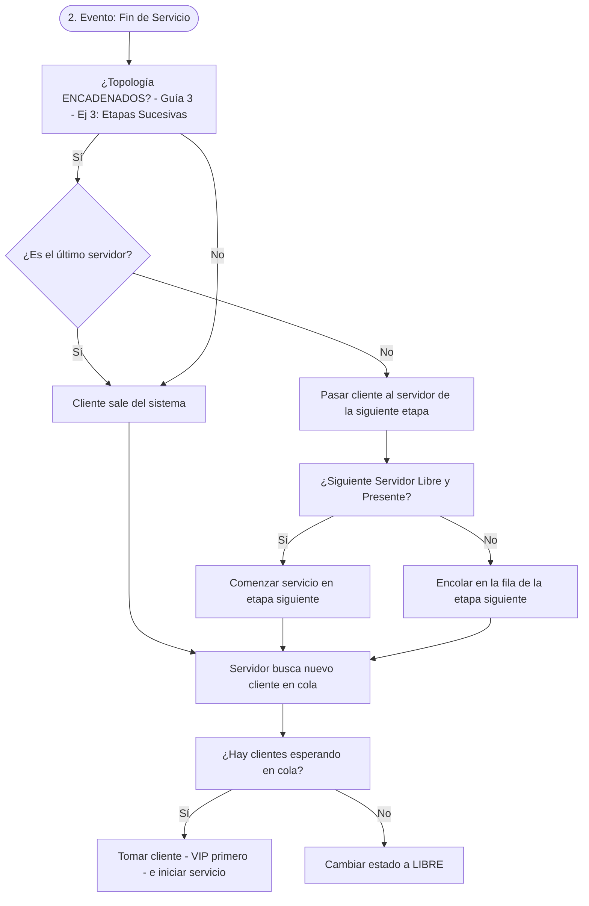
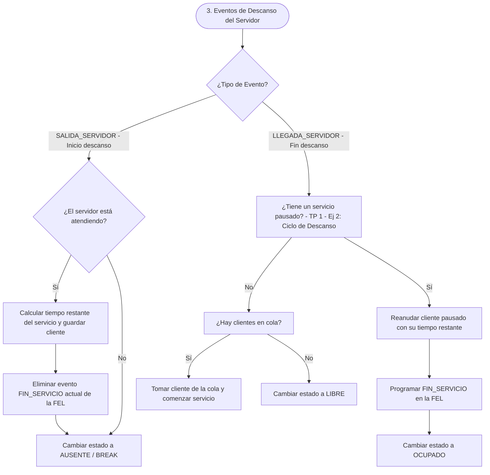
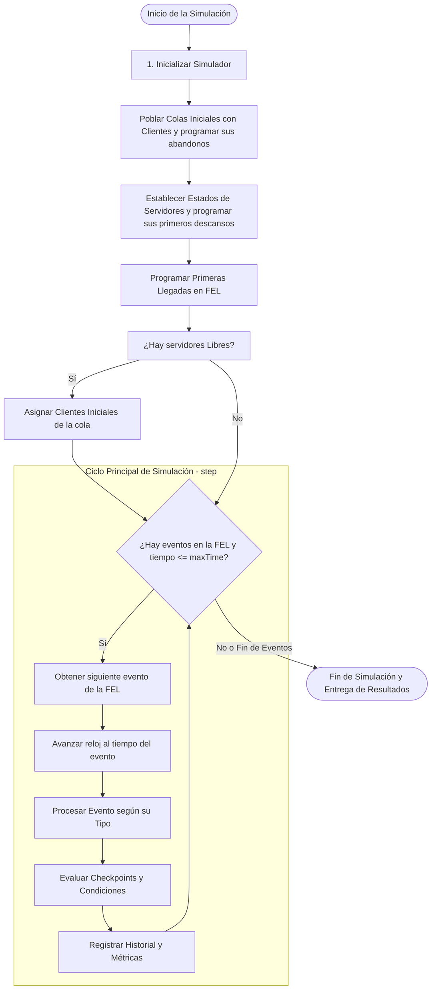
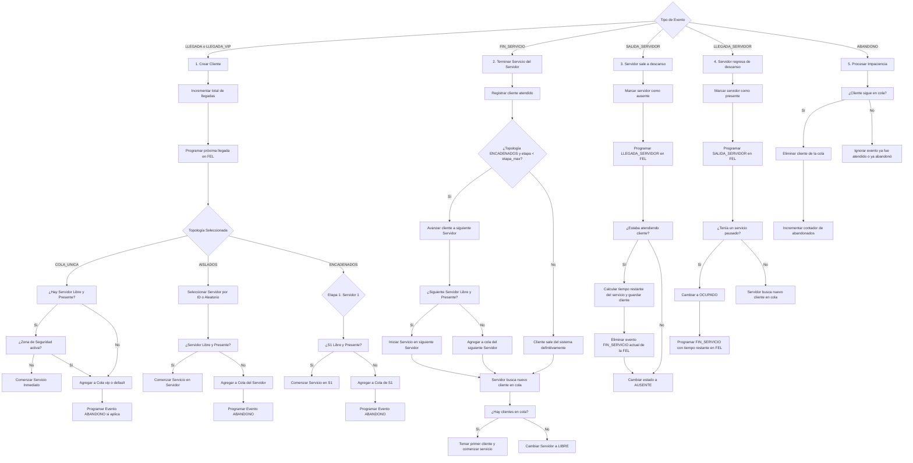
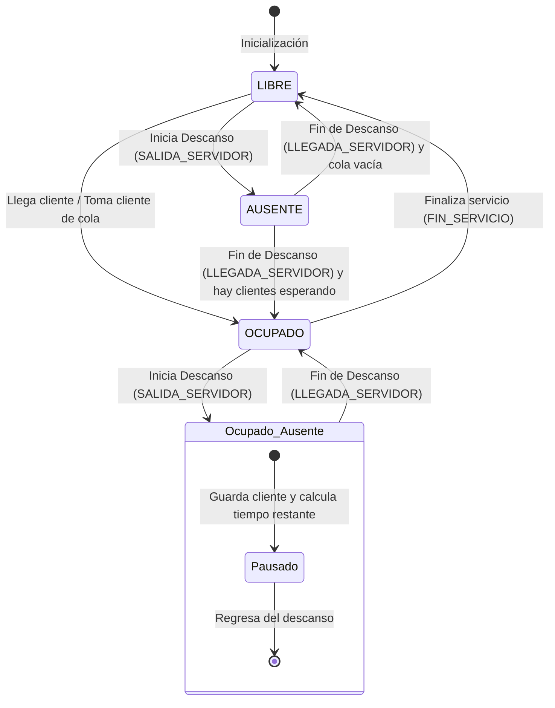

# EventMaster - Diagrama de Flujo Lógico y Flexibilidad del Sistema

Este documento describe la arquitectura y el flujo lógico de **EventMaster**, un simulador de Teoría de Colas basado en el método de **Simulación de Eventos Discretos (DES - Discrete Event Simulation)**. A continuación, se detallan el ciclo de vida del simulador, el procesamiento de eventos y cómo se manifiesta la flexibilidad en cada parte del sistema.

---

## 1. Mapa General del Sistema: Visión General y Selección de Flujo

Este diagrama de alto nivel muestra cómo se conectan todas las partes del simulador. Sirve como **mapa de ruta** para entender qué ocurre en cada etapa y qué diagrama consultar para cada detalle.

### 1.1 Guía de Navegación de Diagramas

| Para entender... | Ir a... |
|-----------------|---------|
| Cómo llega un cliente y se encola | Diagrama 3.1 (sección 3.1) |
| Cómo termina un servicio y fluye entre servidores | Diagrama 3.2 - Fin de Servicio |
| Cómo funcionan los descansos del servidor | Diagrama 3.2 - Descansos |
| Ciclo de vida completo del simulador | Diagrama 4 (sección 4) |
| Procesamiento detallado de cada tipo de evento | Diagrama 5 (sección 5) |
| Estados posibles de un servidor | Diagrama 6 (sección 6) |
| Cómo se organizan las colas por topología | Diagrama 7 (sección 7) |

---

## 2. Conceptos Clave de la Flexibilidad en EventMaster

La flexibilidad del simulador se define mediante varias configuraciones y banderas dinámicas (`flags`):

1. **Topologías de Sistema (`SystemTopology`):**
   * **COLA_UNICA (Single Queue):** Múltiples servidores atienden a partir de una única fila central (con soporte para prioridad VIP).
   * **AISLADOS (Isolated):** Cada servidor cuenta con su propia fila independiente. Los clientes ingresan directamente a la fila de un servidor específico.
   * **ENCADENADOS (Chained):** Proceso secuencial o en etapas. El cliente debe ser atendido secuencialmente por el Servidor 1, luego el Servidor 2, y así sucesivamente.
   
2. **Priorización (VIP):**
   * Habilitación de flujo VIP donde los clientes B (VIP) saltan al principio de la fila o se gestionan en una fila dedicada y tienen prioridad en eventos futuros (`ARRIVAL_VIP` con prioridad 3 vs `ARRIVAL` con prioridad 4).

3. **Abandonos por Impaciencia (`ABANDONO`):**
   * Cada cliente tiene un tiempo de paciencia generado aleatoriamente. Si el tiempo de espera supera este límite, se dispara un evento de abandono que retira al cliente de la cola de forma segura.

4. **Ciclos de Trabajo y Descanso (`Server Breaks`):**
   * Los servidores alternan de forma autónoma entre períodos de trabajo y descanso. Si un servidor sale a descanso mientras atiende a un cliente, el servicio se pausa (calculando el tiempo restante) y se reanuda al regresar.

5. **Generadores Estadísticos Flexibles:**
   * Soporte para distribuciones Exponenciales, Uniformes, de Lista y Constantes tanto para llegadas, servicios, descansos y paciencia.

---

## 3. Funcionamiento y Lógica General del Sistema (Casos de Estudio)

A continuación se detalla la lógica de decisión (sí/no) implementada en el motor para resolver las diferentes reglas académicas de las Guías y Trabajos Prácticos (TP).

### 3.1 Flujo de Llegada de Clientes (Ruteo y Encolado)

Este flujo describe el camino de un cliente (o pieza) desde que ingresa al sistema, evaluando condiciones límite extraídas de los ejercicios:

### 3.2 Flujo de Fin de Servicio y Descansos (Servidores)

Este flujo describe la lógica del servidor cuando termina una atención o cuando inicia/termina sus ciclos de descanso:

---

## 4. Ciclo de Vida General del Simulador

El motor de simulación opera bajo un reloj no lineal que salta de evento en evento según el orden de prioridad y tiempo definido en la **Lista de Eventos Futuros (FEL)**.

---

## 5. Diagrama de Flujo del Procesamiento de Eventos

Este diagrama detalla cómo reacciona el sistema ante cada tipo de evento en la FEL, reflejando las variaciones lógicas basadas en la configuración de la **Topología**, **Descansos** e **Impaciencia**.

---

## 6. Estado de los Servidores: Ciclo Trabajo-Descanso (Pausa y Reanudación)

Una de las características más avanzadas y flexibles del motor es el manejo dinámico de las ausencias del servidor sin perder el progreso de la atención en curso.

---

## 7. Ruteo de Clientes Según la Topología Seleccionada

Este diagrama ilustra cómo fluyen y se agrupan los clientes físicamente en las colas dependiendo de la flexibilidad de la topología elegida.

```mermaid
graph TD
    subgraph Cola_Unica [Topología: COLA ÚNICA]
        Clientes1[Llegada de Clientes] --> ColaVIP["Fila VIP - Prioridad"]
        Clientes1 --> ColaDefault["Fila General"]
        ColaVIP --> Dist[Distribuidor Central]
        ColaDefault --> Dist
        Dist --> S1_CU[Servidor 1]
        Dist --> S2_CU[Servidor 2]
    end

    subgraph Aislados [Topología: AISLADOS]
        Clientes2[Llegada de Clientes] --> Selector{Asignación}
        Selector -->|Servidor 1| Queue1["Cola Servidor 1"]
        Queue1 --> S1_AIS[Servidor 1]
        Selector -->|Servidor 2| Queue2["Cola Servidor 2"]
        Queue2 --> S2_AIS[Servidor 2]
    end

    subgraph Encadenados [Topología: ENCADENADOS]
        Clientes3[Llegada de Clientes] --> Stage1["Cola Etapa 1"]
        Stage1 --> S1_CH[Servidor 1]
        S1_CH --> Stage2["Cola Etapa 2"]
        Stage2 --> S2_CH[Servidor 2]
        S2_CH --> SalidaChained([Salida del Sistema])
    end
```

